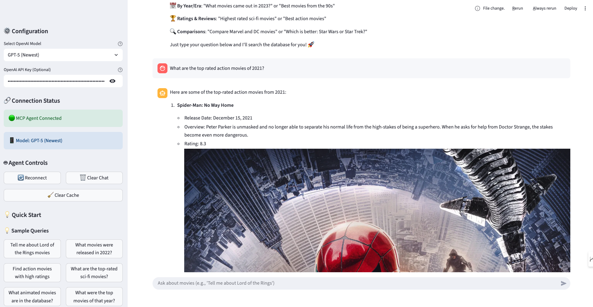

# MCP Movies Database Workshop

A comprehensive **Model Context Protocol (MCP)** demonstration project showcasing AI-powered movie database interactions through a complete client-server architecture.

## 🎯 Project Overview

This project demonstrates how to build production-ready MCP applications with:
- **MCP Server**: FastMCP-based server exposing movie database CRUD operations
- **MCP Client**: Streamlit chatbot for natural language movie queries
- **Database Layer**: SQLite with comprehensive movie data and analytics
- **AI Integration**: GPT-4o powered conversational interface

## 🏗️ Architecture

```
┌─────────────────────────────────────────────────────────────┐
│                    User Interface                           │
│                 (Streamlit Web App)                         │
└─────────────────┬───────────────────────────────────────────┘
                  │ Natural Language Queries
┌─────────────────▼───────────────────────────────────────────┐
│                 MCP Client                                  │
│            (movies_chatbot.py)                              │
│  ┌─────────────────────────────────────────────────────┐    │
│  │  MCPAgent (GPT-4o) + MCPClient (mcp-use)           │    │
│  └─────────────────────────────────────────────────────┘    │
└─────────────────┬───────────────────────────────────────────┘
                  │ MCP Protocol (HTTP)
┌─────────────────▼───────────────────────────────────────────┐
│                 MCP Server                                  │
│           (movies_mcp_server.py)                            │
│  ┌─────────────────────────────────────────────────────┐    │
│  │  FastMCP Tools: CRUD Operations & Analytics        │    │
│  │  • create_movie  • search_movies  • get_statistics │    │
│  │  • update_movie  • delete_movie   • advanced_search│    │
│  └─────────────────────────────────────────────────────┘    │
└─────────────────┬───────────────────────────────────────────┘
                  │ SQL Queries
┌─────────────────▼───────────────────────────────────────────┐
│              SQLite Database                                │
│                (movies.db)                                  │
│         Indexed movie data with metadata                    │
└─────────────────────────────────────────────────────────────┘
```

## 🚀 Quick Start Guide

### Prerequisites
- Python 3.8+
- OpenAI API key
- Terminal/Command line access

### 1. Installation

```bash
# Clone or navigate to the project directory
cd dds_workshop

# Install all required dependencies
pip install -r requirements.txt
```

### 2. Environment Setup

Create a `.env` file in the project root:
```bash
# OpenAI API Configuration (Required)
OPENAI_API_KEY=your_openai_api_key_here

# Database Configuration (Optional - defaults provided)
DB_FILE_PATH=./data/movies.db
CSV_FILE_PATH=./data/mymoviedb.csv
MCP_CONFIG_FILE_PATH="./config/mcp_config.json
```

### 3. Database Setup (First Time Only)

```bash
# Ingest CSV data into SQLite database
python utilities/ingest_movies_to_sqlite.py
```

**Expected Output:**
```
Starting ingestion from: ./data/mymoviedb.csv
Reading CSV file...
Detected encoding: utf-8
Dataset info:
Total rows: [number]
Successfully inserted [number] movies into the database!
✅ Movie database ingestion completed successfully!
```

### 4. Start the MCP Server

**Terminal 1:**
```bash
# Navigate to server directory
cd server/

# Start the MCP server
python movies_mcp_server.py
```

**Expected Output:**
```
Starting Movies Database MCP Server...
Database: ./data/movies.db

Available tools:
- create_movie
- get_movie_by_id
- search_movies_by_title
- get_movies_by_genre
- ... and more

Server is running...
```

**Server will be available at:** `http://0.0.0.0:4567`

### 5. Start the MCP Client

**Terminal 2:**
```bash
# Navigate to client directory  
cd client/

# Start the Streamlit chatbot
streamlit run movies_chatbot.py
```

**Expected Output:**
```
You can now view your Streamlit app in your browser.

Local URL: http://localhost:8501
Network URL: http://[your-ip]:8501
```


  
### 6. Use the Application

1. **Open your browser** to `http://localhost:8501`
2. **Wait for initialization** - "Initializing MCP agent..." 
3. **Start chatting** with example queries:
   - "Tell me about The Matrix"
   - "Find action movies with high ratings"
   - "What movies were released in 2023?"
   - "Show me sci-fi movies from the 2000s"

## 📁 Project Structure

```
dds_workshop/
├── README.md                    # This file - main project overview
├── requirements.txt             # Python dependencies
├── .env                        # Environment variables (create this)
│
├── client/                     # MCP Client (Streamlit Chatbot)
│   ├── movies_chatbot.py       # Main chatbot application
│   └── README.md              # Detailed client documentation
│
├── server/                     # MCP Server (FastMCP)
│   ├── movies_mcp_server.py    # MCP server with movie tools
│   └── README.md              # Detailed server documentation
│
├── config/                     # Configuration files
│   └── mcp_config.json        # MCP server connection config
│
├── data/                       # Database and source data
│   ├── movies.db              # SQLite database (generated)
│   └── mymoviedb.csv          # Source CSV data
│
├── utilities/                  # Database utilities
│   ├── constants.py           # Configuration constants
│   ├── ingest_movies_to_sqlite.py  # CSV to SQLite ingestion
│   └── movies_crud.py         # Direct database operations
│
└── supporting_files/          # Workshop materials
    ├── agenda.txt
    ├── mcp_architecture.png
    └── react.md
```

## 💬 Example Interactions

### Natural Language Movie Queries
```
🎬 User: "Tell me about Lord of the Rings movies"
🤖 Assistant: Here are the Lord of the Rings movies:

1. **The Lord of the Rings: The Fellowship of the Ring** (2001)
   - Rating: 8.8/10 (1.8M votes)
   - Genre: Adventure, Fantasy, Action
   - Overview: A meek Hobbit from the Shire and eight companions...

2. **The Lord of the Rings: The Two Towers** (2002)
   - Rating: 8.7/10 (1.6M votes)
   - Genre: Adventure, Fantasy, Action
   - Overview: Frodo and Sam are trekking to Mordor...

3. **The Lord of the Rings: The Return of the King** (2003)
   - Rating: 9.0/10 (1.8M votes)
   - Genre: Adventure, Fantasy, Action
   - Overview: Aragorn is revealed as the heir to the ancient kings...
```

### Advanced Search Capabilities
```
🎬 User: "Find sci-fi movies from 2020-2023 with ratings above 7.5"
🤖 Assistant: Here are highly-rated sci-fi movies from 2020-2023:

1. **Dune** (2021) - Rating: 8.0/10
2. **Spider-Man: No Way Home** (2021) - Rating: 8.4/10
3. **The Batman** (2022) - Rating: 7.8/10
...
```

## 🛠️ Available Features

### MCP Server Tools (11 total)
- **Create**: Add new movies with metadata
- **Search**: Title, genre, year, language filtering
- **Update**: Modify existing movie data
- **Delete**: Remove movies from database
- **Analytics**: Comprehensive database statistics

### Client Capabilities
- **Natural Language Processing**: Ask questions in plain English
- **Real-time Responses**: Streaming AI responses
- **Chat History**: Persistent conversation context
- **Error Handling**: Graceful error recovery
- **Example Queries**: Built-in query suggestions

## 🔧 Troubleshooting

### Common Issues

**1. Database not found**
```bash
# Solution: Run the ingestion script first
python utilities/ingest_movies_to_sqlite.py
```

**2. MCP Server connection failed**
```bash
# Check if server is running
curl http://0.0.0.0:4567/mcp

# Verify config in config/mcp_config.json
```

**3. OpenAI API errors**
```bash
# Verify API key is set
echo $OPENAI_API_KEY

# Check .env file exists and is loaded
```

**4. Port conflicts**
```bash
# Server: Change port in movies_mcp_server.py
mcp.run(transport="http", host="0.0.0.0", port=4568)

# Client: Use different Streamlit port
streamlit run movies_chatbot.py --server.port 8502
```

### Debug Mode
```bash
# Enable verbose logging
export PYTHONPATH=.
python -c "import logging; logging.basicConfig(level=logging.DEBUG)"
```

## 📊 Database Information

- **Total Movies**: ~50,000+ entries
- **Date Range**: 1900s to 2024
- **Languages**: 100+ languages
- **Genres**: Action, Comedy, Drama, Sci-Fi, etc.
- **Metadata**: Ratings, popularity, vote counts, overviews

## 🔍 Advanced Usage

### Direct Database Access
```bash
# Use CRUD utilities directly
python utilities/movies_crud.py
```

### Custom Queries
```python
# Test MCP server tools directly
python -c "
import asyncio
from mcp_use import MCPClient

async def test():
    client = MCPClient.from_config_file('config/mcp_config.json')
    result = await client.call_tool('search_movies_by_title', {'title_search': 'Matrix'})
    print(result)

asyncio.run(test())
"
```

### Configuration Customization
- **Server Config**: Modify `config/mcp_config.json`
- **Agent Behavior**: Adjust `max_steps` in client code
- **UI Styling**: Customize Streamlit interface

## 🎓 Learning Objectives

This workshop demonstrates:
1. **MCP Protocol Implementation**: Client-server communication
2. **AI Agent Integration**: LLM + Tool selection
3. **Database Operations**: CRUD with intelligent querying  
4. **Web Interface Development**: Real-time chat applications
5. **Error Handling**: Robust production patterns
6. **Configuration Management**: Environment-based setup

## 📚 Additional Resources

- **Detailed Documentation**: 
  - [Server README](server/README.md) - Complete server API reference
  - [Client README](client/README.md) - UI and integration details
- **MCP Specification**: [Model Context Protocol](https://modelcontextprotocol.io/)
- **FastMCP Framework**: [FastMCP Documentation](https://github.com/jlowin/fastmcp)
- **Streamlit**: [Streamlit Documentation](https://docs.streamlit.io/)

## 🤝 Contributing

1. **Extend Tools**: Add new MCP server tools for additional functionality
2. **Enhance UI**: Improve the Streamlit interface with new features
3. **Add Data Sources**: Integrate additional movie databases
4. **Optimize Performance**: Implement caching and query optimization
5. **Documentation**: Update READMEs with new features
